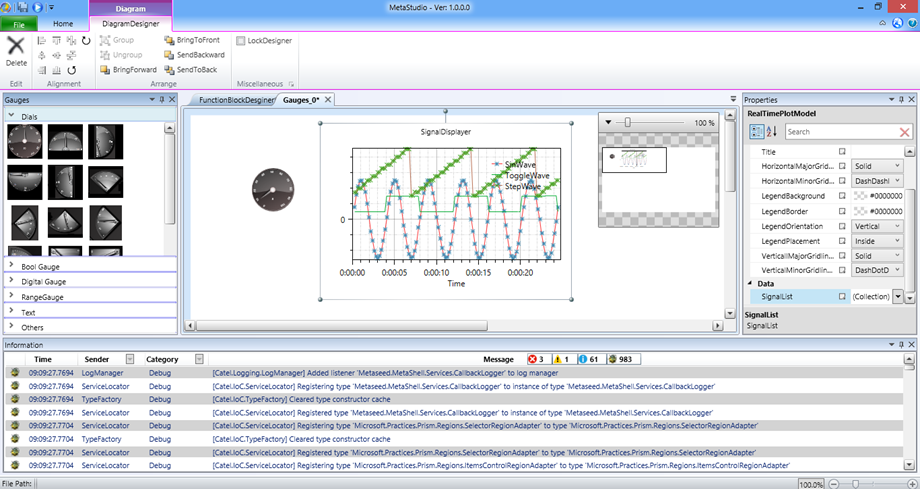
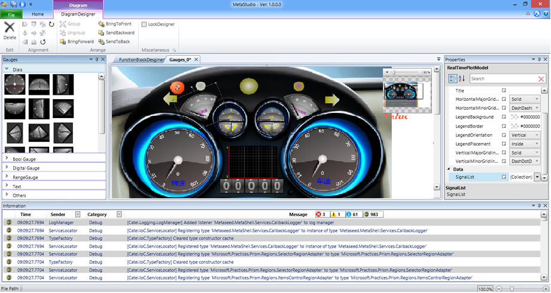
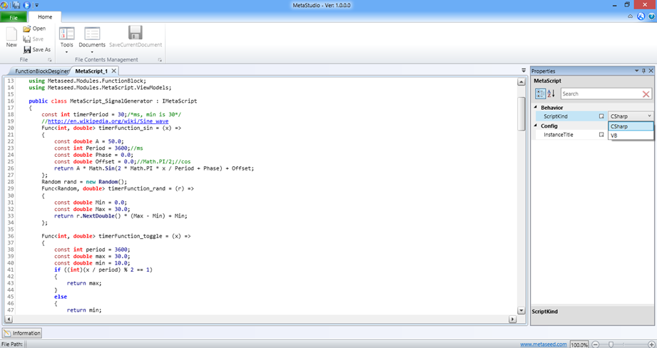

MetaStudio is based on WPF. It is designed to provide battery-included solutions for common aspects of Line of Business Desktop software, so the development can just be focused onto business feature implantation.

## Pictures

